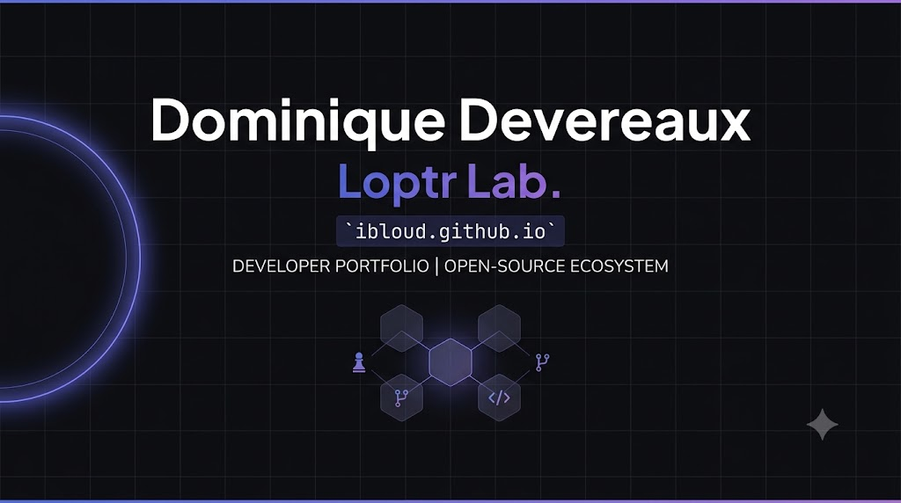

## 🌐 Live Ecosystem
The live production portfolio is dynamically accessible at: **[ibloud.github.io](https://ibloud.github.io)** (Mirror: **[ibloud.xyz](https://ibloud.xyz)**)

---

## 🛠️ Structural Core & System Intent
Welcome to my public development workspace. This repository contains the source infrastructure for my personal engineering portfolio, designed with absolute structural intent, strict visual minimalism, and optimized technical layout. 

The site operates as a self-sustaining system, automatically aggregating projects across both personal and organizational profiles to highlight live builds, prototype versioning, and architectural research paradigms.

### ⚡ Flagship Framework Spotlight
* **Veiled Dominion Engine (`Loptr-Lab/veiled-dominion-engine`):** An open prototype 4-player chess variant variant framework engineered around mechanics of systemic restraint, regulation, and inclusive architecture rather than aggressive capture rules.

---

## 🎨 System Highlights & Architecture
- **Dynamic API Aggregation:** Asynchronous engine that fetches, filters, and ranks public updates directly via the GitHub API.
- **Structural Readability:** Built with a performance-focused Tailwind CSS implementation using precise dark-mode scales (`#0d0e12`), leveraging strict typographic visual hierarchy via `Plus Jakarta Sans` and code tokens in `JetBrains Mono`.
- **Responsive Layout:** Engineered using explicit block styling and fluid-fluid scaling constraints to guarantee full layout integrity across modern desktop viewpoints and mobile viewports.

---

## 📂 Repository Contents
```text
├── index.html          # Core single-file portfolio engine, structure, and style architecture
├── repo-banner.png     # Open Graph / Repository identity asset
└── README.md           # Documentation core
