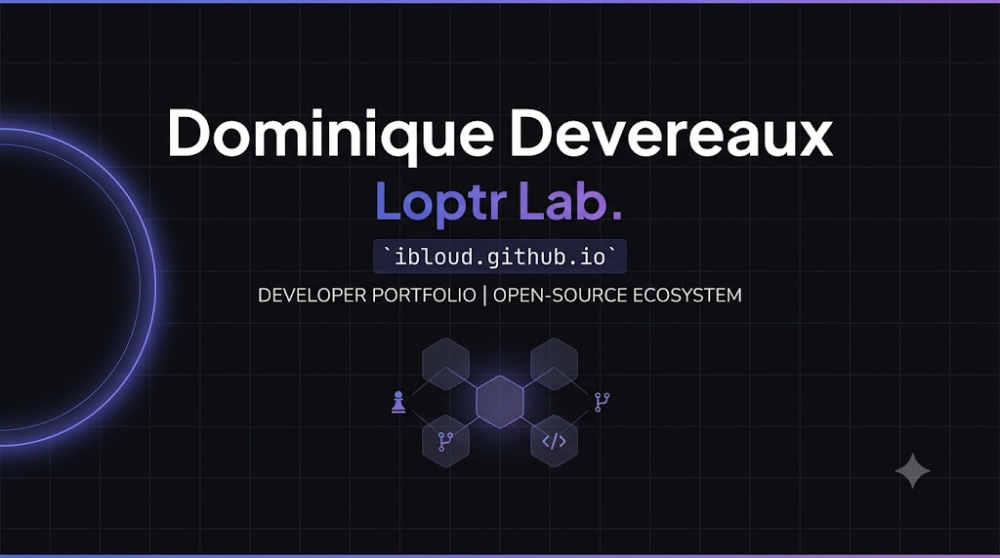

## 🌐 Live Ecosystem

The live production portfolio is dynamically accessible at: **[ibloud.github.io](https://ibloud.github.io)** (Mirror: **[ibloud.xyz](https://ibloud.xyz)**)

---

## 🛠️ Structural Core & System Intent

Welcome to my public development workspace. This repository contains the source infrastructure for my personal engineering portfolio, designed with absolute structural intent, strict visual minimalism, and optimized technical layout.

The site operates as a self-sustaining system, automatically aggregating projects across both personal and organizational profiles to highlight live builds, prototype versioning, and architectural research paradigms.

### ⚡ Flagship Framework Spotlight

* **Veiled Dominion Engine (`Loptr-Lab/veiled-dominion-engine`):** An open prototype 4-player chess variant framework engineered around mechanics of systemic restraint, regulation, and inclusive architecture rather than aggressive capture rules.

---

## Return to the Void — Technical Breakdown

An open-source MOBA framework built around Epic's released Paragon assets, a modular card/tarot system, and a browser-native WebGL companion layer.

Full project context: [sites.google.com/view/rtn2thevoid/journey](https://sites.google.com/view/rtn2thevoid/journey)

### Audio foundation

["Returning to the Void (Paragon Homage)"](https://audius.co/baphometrix/returning-to-the-void-paragon-homage-15668) — Baphometrix (2019). Downtempo teaser track built from Epic Games vocal and audio assets, used with permission. The earliest public artifact of this project.

---

## Can Paragon be rebuilt from Epic's released assets alone?

**Short answer: no — not right out of the box.**

Epic released over $17 million worth of Paragon assets for free via the Unreal Engine Marketplace (now Fab). What they provided is the full art and audio foundation — not the game code, server architecture, or gameplay systems.

### What Epic did release

- **39+ fully rigged heroes** — Gideon, Kallari, TwinBlast, Steel, Sparrow, Boris, and more. Each includes skins, high-res textures, animation sets, VFX, and voice lines.
- **Environment packs** — 1,500+ components: foliage, architecture, lighting, and sample maps (Agora, Monolith).
- **Minions & creeps** — visual and animation models for lane and jungle units.

### What still has to be built

| Component | Status |
|---|---|
| 3D Hero Models & Rigging | ✅ Released by Epic |
| Hero Animations & VFX | ✅ Released by Epic |
| Environments & Props | ✅ Released by Epic |
| Game Logic & Mechanics | ❌ Must be written — abilities, cooldowns, leveling, item shop, objectives |
| Networking & Servers | ❌ Must be written — matchmaking, client-server sync, anti-cheat |
| UI/UX | ❌ Must be written — HUD, menus, inventory, scoreboard |
| AI & Pathfinding | ❌ Must be written — minion behavior trees, tower targeting |
| Card UI / 2D Tarot Art | ❌ Must be created — custom illustration and UI frames |
| Card Engine / Deck Logic | ❌ Must be written — data tables, Blueprint mechanics |

### Has anyone built it?

Yes. Two studios have shipped games using these exact assets plus custom code:

- **Predecessor** (Omeda Studios) — built almost entirely on the released Paragon assets with custom gameplay code. Received official backing from Epic Games and launched as a full live-service game on PC and consoles.
- **Overprime** (Netmarble / Souleve) — used the assets with custom gameplay elements. Servers shut down in early 2024.

Both took years of engineering work to fill the gaps Epic left.

---

## Integration strategy

**[veiled-dominion-engine](https://github.com/Loptr-Lab/veiled-dominion-engine)** handles the web layer — deck builder, hero lore viewer, and rapid prototype environment for validating game rules and card logic before porting to Unreal C++.

**Unreal Engine 5** handles the core game — character abilities via the Gameplay Ability System, Niagara VFX, network replication, and the open-source C++ architecture built for community contribution.

---

## Get involved — training program

This project is a **living environment** built so newcomers can find where they fit and contribute to a real production pipeline. The [Loptr-Lab/training](https://github.com/Loptr-Lab/training) repo is the hands-on entry point — a self-contained TypeScript coding exercise that maps directly onto real engine work.

### Before you start

- Read **[`THE_THRESHOLD.md`](https://github.com/Loptr-Lab/training/blob/main/THE_THRESHOLD.md)** — the world, its philosophy, and why "restraint over conquest" is the idea everything else has to serve.
- New to GitHub? Complete the **[GitHub Skills tutorial](https://learn.github.com/skills)** first — a 10-minute interactive sandbox for branching, commits, and pull requests.
- Study the core game rules well enough to explain them without notes.

### Three tracks — find where you fit

**Track A: Prototype Engineer** (~4 weeks)
TypeScript/OOP fundamentals, finite state machines, test-driven development, spatial and coordinate systems, status-effect and timed state systems. The training exercise is the centerpiece — scored entirely via Jest.

**Track B: Systems Designer** (~3 weeks)
Game economy modeling, quantitative balance analysis, structured playtesting methodology. See `docs/design/GDD.md` in the engine repo.

**Track C: Technical Artist** (~2–3 weeks)
Shader programming for the engine's signature visual effects built against real accessibility constraints. See `docs/ENGINE_ACCESSIBILITY_A11Y_PARADOX.md` in the engine repo.

### Recommended resources

| Resource | Tracks | Why |
|---|---|---|
| [GitHub Skills](https://learn.github.com/skills) | Prerequisites | Interactive sandbox for Git basics, branching, and pull requests |
| [Clean Coders](https://cleancoders.com/) | A, B | The philosophy behind how this project is organized |
| [Tom Looman's Unreal tutorials](https://www.tomlooman.com/) | A | Recommended entry point for Unreal C++ and GAS |
| [Epic Web](https://epicweb.dev) | A, B | Full-stack patterns — auth, routing, server/client separation |
| [Testing JavaScript](https://testingjavascript.com) | A | "Test behavior, not implementation" — exactly the mindset the exercise rewards |
| [Epic React](https://epicreact.dev) | A, C | UI layer, relevant when moving beyond vanilla JS |
| [Open Source Guide](https://opensource.guide/) | All | How open-source projects work and how to contribute |

### VRS / vocational rehabilitation

This training program is supported under MN Vocational Rehabilitation Services (VRS) and compatible with state workforce agency funding. Under Title I of the Rehabilitation Act, all state VR agencies cover tech/IT training if it supports competitive integrated employment goals. Use the [Interactive State Agency & Voc-Rehab Lookup Tool](https://loptr-lab.github.io/training/state-resources.html) to find your state's intake links and funding availability.

---

## 🎨 System Highlights & Architecture

- **Dynamic API Aggregation:** Asynchronous engine that fetches, filters, and ranks public updates directly via the GitHub API.
- **Structural Readability:** Built with a performance-focused Tailwind CSS implementation using precise dark-mode scales (`#0d0e12`), leveraging strict typographic visual hierarchy via `Plus Jakarta Sans` and code tokens in `JetBrains Mono`.
- **Responsive Layout:** Engineered using explicit block styling and fluid-fluid scaling constraints to guarantee full layout integrity across modern desktop viewpoints and mobile viewports.

---

## 📂 Repository Contents

```text
├── index.html          # Core single-file portfolio engine, structure, and style architecture
├── repo-banner.png     # Open Graph / Repository identity asset
└── README.md           # Documentation core
```

---

## Related repos

| Repo | What it is |
|---|---|
| [Loptr-Lab/training](https://github.com/Loptr-Lab/training) | Standalone TypeScript coding exercise — candidate evaluation and VRS-supported training |
| [Loptr-Lab/veiled-dominion-engine](https://github.com/Loptr-Lab/veiled-dominion-engine) | The browser-native WebGL engine powering the web companion layer |
| [ibloud/violets-revenge](https://github.com/ibloud/violets-revenge) | Open-source 1v4 asymmetric horror game — separate externship/portfolio project |

---

## Contact

**Music:** [audio.com/ibloud-ivxx](https://audio.com/ibloud-ivxx)
**Paragon Homage:** [Returning to the Void — Audius](https://audius.co/baphometrix/returning-to-the-void-paragon-homage-15668)
**Questions:** questions@loptrlab.com

---

## License

Content and written analysis © 2026 Dominique Devereaux (ibloud) — Loptr Lab, licensed under [CC BY 4.0](https://creativecommons.org/licenses/by/4.0/).

Paragon assets are subject to Epic Games' Paragon Asset EULA and are not distributed here.
